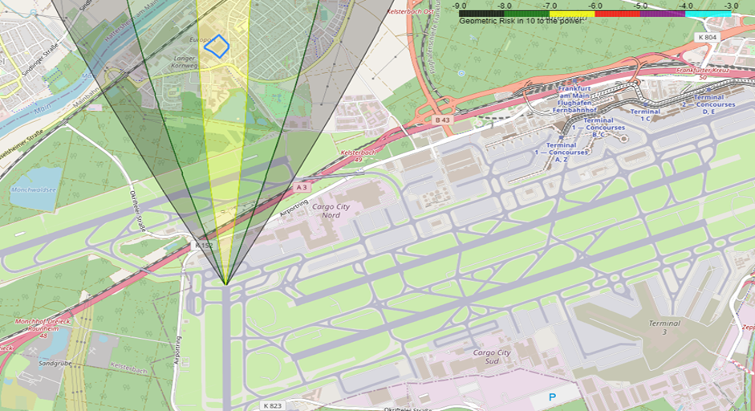
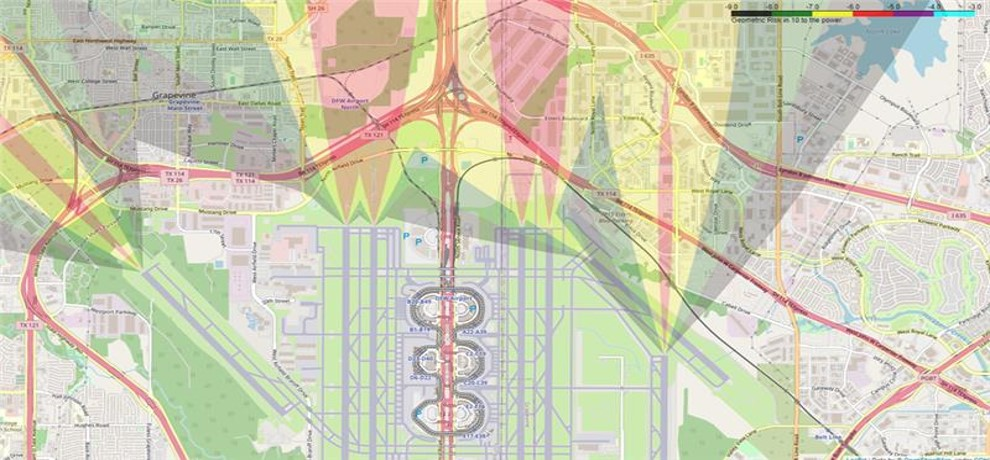

# Airport risk contours on maps

- This repo contains the code for generating the risk contours overlayed on interactive maps. 
- Here risk is geometric likelihood of an accident due to airport takeoff and landing. Contact 
- This is a general purpose code can be used to plot risk contours for any airport given that the inputs are compatible [Jan Gramkov](jag@ramboll.dk) or [Louise Bjerrum Paillet](lwb@ramboll.dk)
- Refer to the `user_inputs.py` file to see how inputs are mentioned. 
- This code can be also used as inspiration to plot any contours over a map, some modifications has to be done though. 

Demo:

Showing the risk contours for Frankfurt Airport, Germany:

<table>
    <tr>
        <td>Image</td>
    </tr>
    <tr>
        <td></td>
    </tr>
    <tr>
        <td></td>
    </tr>
</table>
Showing the risk contours for Dallas Airport, USA:

<table>
    <tr>
        <td></td>
    </tr>
    <tr>
        <td></td>
    </tr>
</table>
